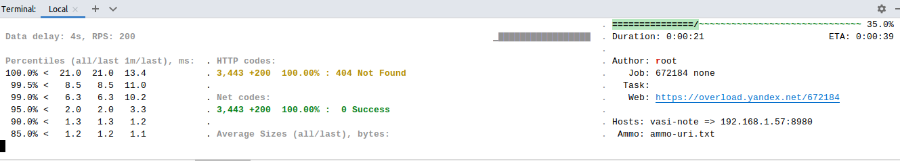
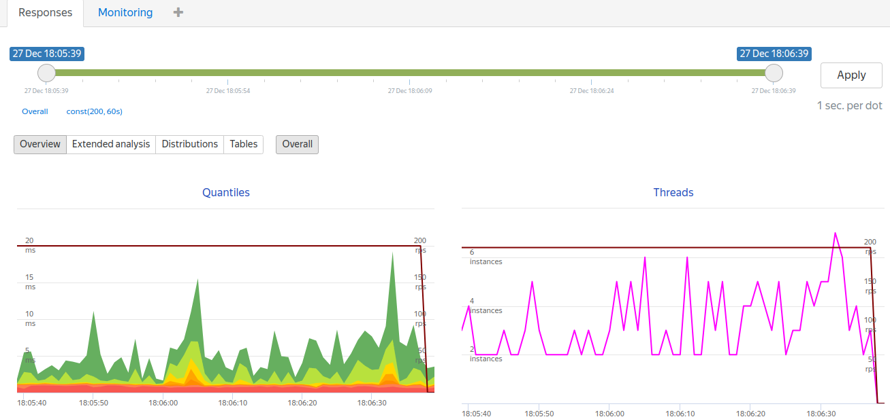

### Нагрузочное тестирование с помощью yandex-tank

Нагрузочное тестирование часто не проводят и метрики получают уже на prod c помощью средств мониторинга (н.п. Grafana). Вопросы типа "Что будет при возросшей нагрузке?" остаются в стороне. И с другой стороны нагрузочное тестирование может показать узкие места при различных сценариях.  

Здесь описан только один из сценариев теста с помощью [Yandex-tank](https://github.com/yandex/yandex-tank). 

Сам yandex-tank крутится в Docker. Скрипт для проведения теста [./tank_run_shop_kotlin.sh](tank_run_shop_kotlin.sh):

````shell
docker run --entrypoint yandex-tank \
    -v $(pwd):/var/loadtest \
    -v $SSH_AUTH_SOCK:/ssh-agent -e SSH_AUTH_SOCK=/ssh-agent \
    --net host \
    -it direvius/yandex-tank

````

Для проведения теста папка <i><b>./ammo</b></i> подключается к docker образу по пути <i><b>/var/loadtest</b></i>. По этому пути (<i><b>/var/loadtest</b></i>) yandex-tank будет искать настройки теста.  

В папке <i><b>/var/loadtest</b></i> 3 файла:
- token.txt - токен для публикации для публикации результатов в сервисе yandex-tank. Токен выдается при регистрации в сервисе.
- load.yaml - задание параметров нагрузки
- ammo-uri.txt - расстреливаемый URI (<i>/api/echo/aaa</i>) без адреса сервиса (<i>http://127.0.0.1:8780)

Файл load.yaml: 

````shell
overload:
    enabled: true
    package: yandextank.plugins.DataUploader
    token_file: "token.txt" #токен для публикации результатов в сервисе yandex-tank. Токен выдается при регистрации в сервисе
phantom:
    address: 192.168.1.20:8980 # адрес тестируемого сервиса
    load_profile: # описание нагрузки
        load_type: rps #тип нагрузки: "rps" - количество запросов в секунду, "matrix" - матричная нагрузка 
        schedule: const(1000, 1m) # нагрузка постоянная (const) 1000 rps в течении 1 минуты
    ammofile: /var/loadtest/ammo-uri.txt # Папка проекта подключена у корню docker, патроны docker будут по пути /var/loadtest/ammo-uri.txt. В ammo-uri.txt описано по какому REST стреляем ("/api/echo/test_message_to_shop"). 
    ammo_type: uri 
console:
    enabled: true # показывать картинку проведения теста
telegraf:
    enabled: false

````

Результат:

[https://overload.yandex.net/671710#tab=test_data&tags=&plot_groups=main&machines=&metrics=&slider_start=1703342886&slider_end=1703342888](https://overload.yandex.net/671710#tab=test_data&tags=&plot_groups=main&machines=&metrics=&slider_start=1703342886&slider_end=1703342888)

### Отчеты при нагрузке 200 rps в течении 60 сек.

Нагрузка постоянная (см. выше schedule: const(200, 1m) # нагрузка постоянная (const) 200 rps)

Вид с машины тестера:



Отчет в сервисе Yandex Tank:
